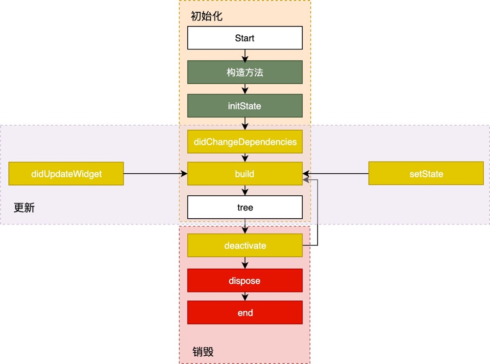
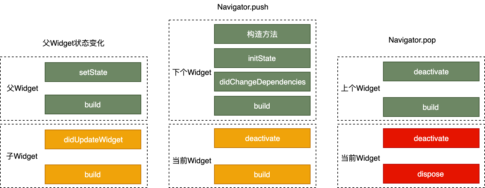

# 生命周期

本内容都来自极客时间陈浩Flutter课程第十一课

## State 生命周期

State 的生命周期，指的是在用户参与的情况下，其关联的 Widget 所经历的，从创建到显示再到更新最后到停止，直至销毁等各个过程阶段。

这些不同的阶段涉及到特定的任务处理，因此为了写出一个体验和性能良好的控件，正确理解 State 的生命周期至关重要。

State 的生命周期流程，如下图所示：

State 的生命周期可以分为 3 个阶段：创建（插入视图树）、更新（在视图树中存在）、销毁（从视图树中移除）。接下来，我们一起看看每一个阶段的具体流程。

### 创建

State 初始化时会依次执行 ：构造方法 -> initState -> didChangeDependencies -> build，随后完成页面渲染。

我们来看一下初始化过程中每个方法的意义。

* 构造方法是 State 生命周期的起点，Flutter 会通过调用 StatefulWidget.createState() 来创建一个 State。我们可以通过构造方法，来接收父 Widget 传递的初始化 UI 配置数据。这些配置数据，决定了 Widget 最初的呈现效果。
* initState，会在 State 对象被插入视图树的时候调用。这个函数在 State 的生命周期中只会被调用一次，所以我们可以在这里做一些初始化工作，比如为状态变量设定默认值。
* didChangeDependencies 则用来专门处理 State 对象依赖关系变化，会在 initState() 调用结束后，被 Flutter 调用。
* build，作用是构建视图。经过以上步骤，Framework 认为 State 已经准备好了，于是调用 build。我们需要在这个函数中，根据父 Widget 传递过来的初始化配置数据，以及 State 的当前状态，创建一个 Widget 然后返回。

### 更新

Widget 的状态更新，主要由 3 个方法触发：setState、didchangeDependencies 与 didUpdateWidget。

接下来，我和你分析下这三个方法分别会在什么场景下调用。

* setState：我们最熟悉的方法之一。当状态数据发生变化时，我们总是通过调用这个方法告诉 Flutter：“我这儿的数据变啦，请使用更新后的数据重建 UI！”
* didChangeDependencies：State 对象的依赖关系发生变化后，Flutter 会回调这个方法，随后触发组件构建。哪些情况下 State 对象的依赖关系会发生变化呢？典型的场景是，系统语言 Locale 或应用主题改变时，系统会通知 State 执行 didChangeDependencies 回调方法。
* didUpdateWidget：当 Widget 的配置发生变化时，比如，父 Widget 触发重建（即父 Widget 的状态发生变化时），热重载时，系统会调用这个函数。
  
一旦这三个方法被调用，Flutter 随后就会销毁老 Widget，并调用 build 方法重建 Widget。

### 销毁

组件销毁相对比较简单。比如组件被移除，或是页面销毁的时候，系统会调用 deactivate 和 dispose 这两个方法，来移除或销毁组件。

接下来，我们一起看一下它们的具体调用机制：

当组件的可见状态发生变化时，deactivate 函数会被调用，这时 State 会被暂时从视图树中移除。值得注意的是，页面切换时，由于 State 对象在视图树中的位置发生了变化，需要先暂时移除后再重新添加，重新触发组件构建，因此这个函数也会被调用。
当 State 被永久地从视图树中移除时，Flutter 会调用 dispose 函数。而一旦到这个阶段，组件就要被销毁了，所以我们可以在这里进行最终的资源释放、移除监听、清理环境，等等。

左边部分展示了当父 Widget 状态发生变化时，父子双方共同的生命周期；而中间和右边部分则描述了页面切换时，两个关联的 Widget 的生命周期函数是如何响应的。

#### A页面进入B页面，然后返回B页面State生命周期

    flutter: page1 initState......
    flutter: page1 didChangeDependencies......
    flutter: page1 build......
    flutter: page2 parent initState......
    flutter: page2 parent didChangeDependencies......
    flutter: page2 parent build......
    flutter: page2 child initState......
    flutter: page2 child didChangeDependencies......
    flutter: page2 child build......
    flutter: page1 deactivate......
    flutter: page1 build......
    flutter: page1 deactivate......
    flutter: page1 build......
    flutter: page2 parent deactivate......
    flutter: page2 child deactivate......
    flutter: page2 child dispose......
    flutter: page2 parent dispose......

##### B页面widget发生变化

    flutter: page2 parent setState......
    flutter: page2 parent build......
    flutter: page2 child didUpdateWidget......
    flutter: page2 child build......

[生命周期demo](https://github.com/cyndibaby905/11_Flutter_lifecycle)

### App生命周期

来监听 App 的生命周期并做相应的处理。而在 Flutter 中，我们可以利用WidgetsBindingObserver，来实现同样的需求。

    abstract class WidgetsBindingObserver {
     // 页面 pop
     Future<bool> didPopRoute() => Future<bool>.value(false);
     // 页面 push
     Future<bool> didPushRoute(String route) => Future<bool>.value(false);
     // 系统窗口相关改变回调，如旋转
     void didChangeMetrics() { }
     // 文本缩放系数变化
     void didChangeTextScaleFactor() { }
     // 系统亮度变化
     void didChangePlatformBrightness() { }
     // 本地化语言变化
     void didChangeLocales(List<Locale> locale) { }
     //App 生命周期变化
     void didChangeAppLifecycleState(AppLifecycleState state) { }
     // 内存警告回调
     void didHaveMemoryPressure() { }
     //Accessibility 相关特性回调
     void didChangeAccessibilityFeatures() {}
    }

AppLifecycleState

* resumed：可见的，并能响应用户的输入。
* inactive：处在不活动状态，无法处理用户响应。
* paused：不可见并不能响应用户的输入，但是在后台继续活动中。
