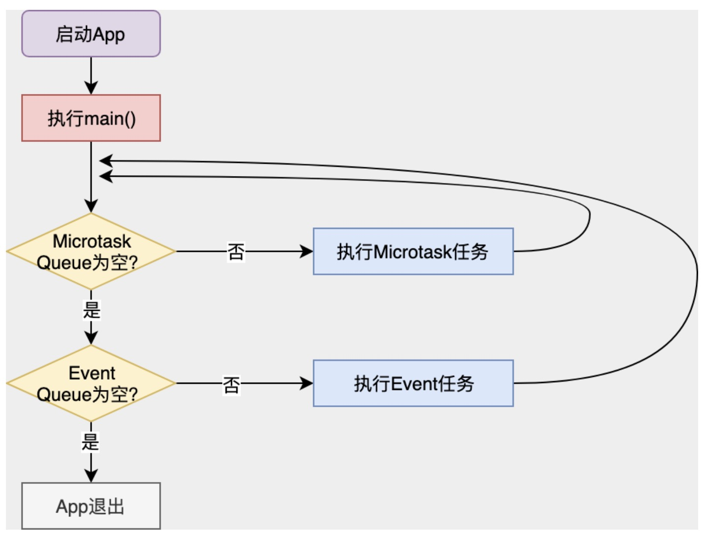

# 单线程

## Event Loop 机制

首先，我们需要建立这样一个概念，那就是**Dart 是单线程的**。那单线程意味着什么呢？这意味着 Dart 代码是有序的，按照在 main 函数出现的次序一个接一个地执行，不会被其他代码中断。另外，作为支持 Flutter 这个 UI 框架的关键技术，Dart 当然也支持异步。需要注意的是，**单线程和异步并不冲突**。

那为什么单线程也可以异步？

这里有一个大前提，那就是我们的 App 绝大多数时间都在等待。比如，等用户点击、等网络请求返回、等文件 IO 结果，等等。而这些等待行为并不是阻塞的。比如说，网络请求，Socket 本身提供了 select 模型可以异步查询；而文件 IO，操作系统也提供了基于事件的回调机制。

所以，基于这些特点，单线程模型可以在等待的过程中做别的事情，等真正需要响应结果了，再去做对应的处理。因为等待过程并不是阻塞的，所以给我们的感觉就像是同时在做多件事情一样。但其实始终只有一个线程在处理你的事情。

等待这个行为是通过 Event Loop 驱动的。像其他语言一样，Dart 也有一个巨大的事件循环，在不断的轮询事件队列，取出事件（比如，键盘事件、I\O 事件、网络事件等），在主线程同步执行其回调函数，

### 异步任务

在 Dart 中，实际上有两个队列，一个事件队列（Event Queue），另一个则是微任务队列（Microtask Queue）。在每一次事件循环中，Dart 总是先去第一个微任务队列中查询是否有可执行的任务，如果没有，才会处理后续的事件队列的流程。

微任务队列。微任务顾名思义，表示一个短时间内就会完成的异步任务。从上面的流程图可以看到，微任务队列在事件循环中的优先级是最高的，只要队列中还有任务，就可以一直霸占着事件循环。

微任务是由 scheduleMicroTask 建立的。

    scheduleMicrotask(() => print('This is a microtask'));

不过，一般的异步任务通常也很少必须要在事件队列前完成，所以也也不需要太高的优先级，因此我们通常很少会直接用到微任务队列，连 Flutter 内部，也只有 7 处用到了而已（比如，手势识别、文本输入、滚动视图、保存页面效果等需要高优执行任务的场景）。

异步任务我们用的最多的还是优先级更低的 Event Queue。比如，I/O、绘制、定时器这些异步事件，都是通过事件队列驱动主线程执行的。

**Dart 为 Event Queue 的任务建立提供了一层封装，叫作 Future**。从名字上也很容易理解，它表示一个在未来时间才会完成的任务。

把一个函数体放入 Future，就完成了从同步任务到异步任务的包装。Future 还提供了链式调用的能力，可以在异步任务执行完毕后依次执行链路上的其他函数体。

正常情况下，一个 Future 异步任务的执行是相对简单的：在我们声明一个 Future 时，Dart 会将异步任务的函数执行体放入事件队列，然后立即返回，后续的代码继续同步执行。而当同步执行的代码执行完毕后，事件队列会按照加入事件队列的顺序（即声明顺序），依次取出事件，最后同步执行 Future 的函数体及后续的 then。

这意味着，**then 与 Future 函数体共用一个事件循环**。而如果 Future 有多个 then，它们也会按照链式调用的先后顺序同步执行，同样也会共用一个事件循环。

如果 Future 执行体已经执行完毕了，但你又拿着这个 Future 的引用，往里面加了一个 then 方法体。面对这种情况，Dart 会将后续加入的 then 方法体放入微任务队列，尽快执行。

**then 会在 Future 函数体执行完毕后立刻执行，无论是共用同一个事件循环还是进入下一个微任务**。

### 异步函数

**Dart 中的 await 并不是阻塞等待，而是异步等待**。Dart 会将调用体的函数也视作异步函数，将等待语句的上下文放入 Event Queue 中，一旦有了结果，Event Loop 就会把它从 Event Queue 中取出，等待代码继续执行。

### Isolate

尽管 Dart 是基于单线程模型的，但为了进一步利用多核 CPU，将 CPU 密集型运算进行隔离，Dart 也提供了多线程机制，即 Isolate。在 Isolate 中，资源隔离做得非常好，每个 Isolate 都有自己的 Event Loop 与 Queue，**Isolate 之间不共享任何资源，只能依靠消息机制通信，因此也就没有资源抢占问题**。

### 总结

Dart 是单线程的，但通过事件循环可以实现异步。而 Future 是异步任务的封装，借助于await 与 async，我们可以通过事件循环实现非阻塞的的同步等待；Isolate 是 Dart 中的多线程，可以实现并发，有自己的事件循环与 Queue，独占资源。solate 之间可以通过消息机制进行单向通信，这些传递的消息通过对方的事件循环驱动对方进行异步处理。

在 UI 编程过程中，异步和多线程是两个相伴相生的名词，也是很容易混淆的概念。对于异步方法调用而言，代码不需要等待结果的返回，而是通过其他手段（比如通知、回调、事件循环或多线程）在后续的某个时刻主动（或被动）地接收执行结果。

因此，从辩证关系上来看，异步与多线程并不是一个同等关系：异步是目的，多线程只是我们实现异步的一个手段之一。而在 Flutter 中，借助于 UI 框架提供的事件循环，我们可以不用阻塞的同时等待多个异步任务，因此并不需要开多线程。我们一定要记住这一点。
