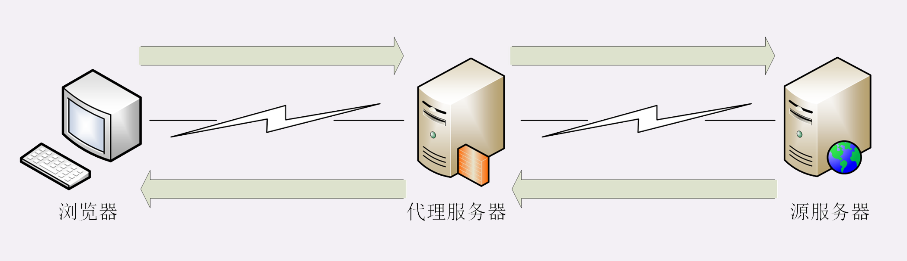

## HTTP的代理服务

所谓的“代理服务”**就是指服务本身不生产内容，而是处于中间位置转发上下游的请求和响应，具有双重身份**：面向下游的用户时，表现为服务器，代表源服务器响应客户端的请求；而面向上游的源服务器时，又表现为客户端，代表客户端发送请求。

代理有很多的种类，常见的有：

1. 匿名代理：完全“隐匿”了被代理的机器，外界看到的只是代理服务器；
2. 透明代理：顾名思义，它在传输过程中是“透明开放”的，外界既知道代理，也知道客户端；
3. 正向代理：靠近客户端，代表客户端向服务器发送请求；
4. 反向代理：靠近服务器端，代表服务器响应客户端的请求；

CDN，实际上就是一种代理，它代替源站服务器响应客户端的请求，通常扮演着透明代理和反向代理的角色。

#### 代理的作用

你也许听过这样一句至理名言：“**计算机科学领域里的任何问题，都可以通过引入一个中间层来解决”（在这句话后面还可以再加上一句“如果一个中间层解决不了问题，那就再加一个中间层**”）。TCP/IP 协议栈是这样，而代理也是这样。

由于代理处在 HTTP 通信过程的中间位置，相应地就对上屏蔽了真实客户端，对下屏蔽了真实服务器，简单的说就是“**欺上瞒下**”。在这个中间层的“小天地”里就可以做很多的事情，为 HTTP 协议增加更多的灵活性，实现客户端和服务器的“双赢”。

代理最基本的一个功能是**负载均衡**。因为在面向客户端时屏蔽了源服务器，客户端看到的只是代理服务器，源服务器究竟有多少台、是哪些 IP 地址都不知道。于是代理服务器就可以掌握请求分发的“大权”，决定由后面的哪台服务器来响应请求。

在负载均衡的同时，代理服务还可以执行更多的功能，比如：

* **健康检查**：使用“心跳”等机制监控后端服务器，发现有故障就及时“踢出”集群，保证服务高可用；
* **安全防护**：保护被代理的后端服务器，限制 IP 地址或流量，抵御网络攻击和过载；
* **加密卸载**：对外网使用 SSL/TLS 加密通信认证，而在安全的内网不加密，消除加解密成本；
* **数据过滤**：拦截上下行的数据，任意指定策略修改请求或者响应；
* **内容缓存**：暂存、复用服务器响应，这个与第 20 讲密切相关，我们稍后再说。

#### 小结
1. HTTP 代理就是客户端和服务器通信链路中的一个中间环节，为两端提供“代理服务”；
2. 代理处于中间层，为 HTTP 处理增加了更多的灵活性，可以实现负载均衡、安全防护、数据过滤等功能；
3. 代理服务器需要使用字段“Via”标记自己的身份，多个代理会形成一个列表；
4. 如果想要知道客户端的真实 IP 地址，可以使用字段“X-Forwarded-For”和“X-Real-IP”；
5. 专门的“代理协议”可以在不改动原始报文的情况下传递客户端的真实 IP。