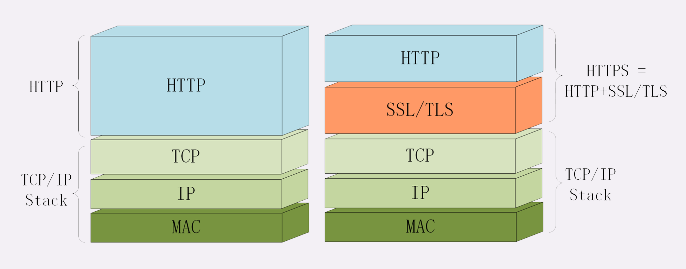

## HTTPS 

https，默认端口号 **443**，至于其他的什么请求 - 应答模式、报文结构、请求方法、URI、头字段、连接管理等等都完全沿用 HTTP，没有任何新的东西。

HTTPS 它把 HTTP 下层的传输协议由 TCP/IP 换成了 SSL/TLS，由“HTTP over TCP/IP”变成了“HTTP over SSL/TLS”，让 HTTP 运行在了安全的 SSL/TLS 协议上，收发报文不再使用 Socket API，而是调用专门的安全接口。

HTTPS相对HTTP提供了更安全的数据传输保障，主要体现在三个方面：

1. 内容加密：客户端到服务器的内容都是以加密形式传输，中间者无法直接查看明文内容；
2. 身份认证：通过校验保证客户端访问的是自己的服务器；
3. 数据完整性：防止内容被第三方冒充或者篡改。

#### 什么是安全？

通常认为，**如果通信过程具备了四个特性，就可以认为是“安全”的**，这四个特性是：**机密性、完整性，身份认证**和**不可否认**。

**机密性**（Secrecy/Confidentiality）是指对数据的“保密”，只能由可信的人访问，对其他人是不可见的“秘密”，简单来说就是不能让不相关的人看到不该看的东西。

**完整性**（Integrity，也叫一致性）是指数据在传输过程中没有被窜改，不多也不少，“完完整整”地保持着原状。

机密性虽然可以让数据成为“秘密”，但不能防止黑客对数据的修改，黑客可以替换数据，调整数据的顺序，或者增加、删除部分数据，破坏通信过程。

**身份认证**（Authentication）是指确认对方的真实身份，也就是“证明你真的是你”，保证消息只能发送给可信的人。

如果通信时另一方是假冒的网站，那么数据再保密也没有用，黑客完全可以使用冒充的身份“套”出各种信息，加密和没加密一样。

第四个特性是**不可否认**（Non-repudiation/Undeniable），也叫不可抵赖，意思是不能否认已经发生过的行为，不能“说话不算数”“耍赖皮”。

使用前三个特性，可以解决安全通信的大部分问题，但如果缺了不可否认，那通信的事务真实性就得不到保证，有可能出现“老赖”。

#### SSL/TLS

SSL 即安全套接层（Secure Sockets Layer），在 OSI 模型中处于第 5 层（会话层），由网景公司于 1994 年发明，有 v2 和 v3 两个版本，而 v1 因为有严重的缺陷从未公开过。

SSL 发展到 v3 时已经证明了它自身是一个非常好的安全通信协议，于是互联网工程组 IETF 在 1999 年把它改名为 TLS（传输层安全，Transport Layer Security），正式标准化，版本号从 1.0 重新算起，所以 TLS1.0 实际上就是 SSLv3.1。

到今天 TLS 已经发展出了三个版本，分别是 2006 年的 1.1、2008 年的 1.2 和去年（2018）的 1.3，每个新版本都紧跟密码学的发展和互联网的现状，持续强化安全和性能，已经成为了信息安全领域中的权威标准。

目前应用的最广泛的 TLS 是 1.2，而之前的协议（TLS1.1/1.0、SSLv3/v2）都已经被认为是不安全的，各大浏览器即将在 2020 年左右停止支持，所以接下来的讲解都针对的是 TLS1.2。

TLS 由记录协议、握手协议、警告协议、变更密码规范协议、扩展协议等几个子协议组成，综合使用了对称加密、非对称加密、身份认证等许多密码学前沿技术。

浏览器和服务器在使用 TLS 建立连接时需要选择一组恰当的加密算法来实现安全通信，这些算法的组合被称为“密码套件”（cipher suite，也叫加密套件）。

TLS 的密码套件命名非常规范，格式很固定。基本的形式是“密钥交换算法 + 签名算法 + 对称加密算法 + 摘要算法”。

HTTPS 的安全性是由 TLS 来保证的。

#### 小结

1. 因为 HTTP 是明文传输，所以不安全，容易被黑客窃听或窜改；
2. 通信安全必须同时具备机密性、完整性，身份认证和不可否认这四个特性；
3. HTTPS 的语法、语义仍然是 HTTP，但把下层的协议由 TCP/IP 换成了 SSL/TLS；
4. SSL/TLS 是信息安全领域中的权威标准，采用多种先进的加密技术保证通信安全；
5. OpenSSL 是著名的开源密码学工具包，是 SSL/TLS 的具体实现。