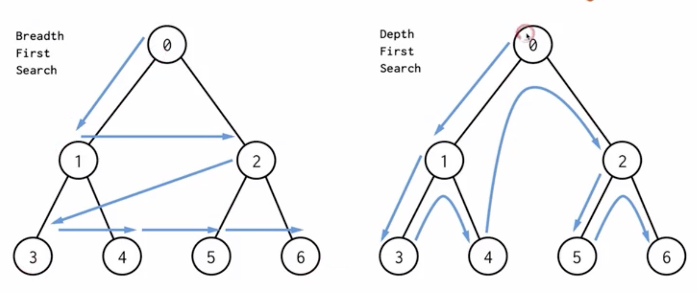
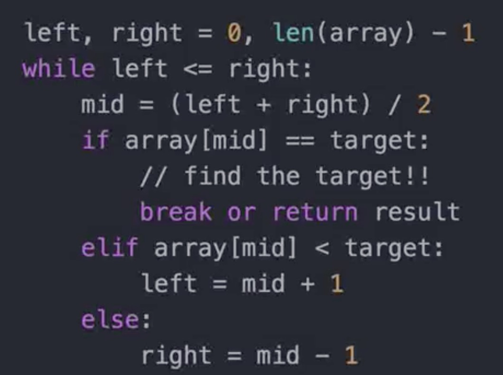
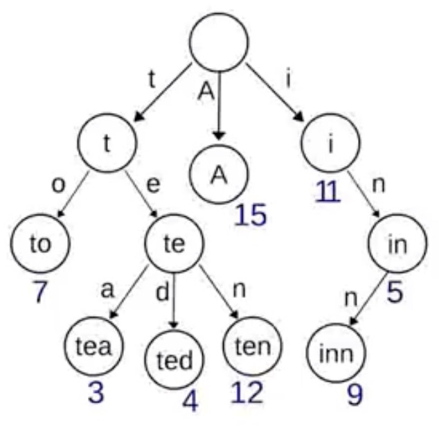

# 递归

递归 - 循环

通过函数体来进行的循环

递归经常在高阶的算法中用到，分治就是其中的一种

奇数还是偶数

如何判断节点已经是这一层的末节点

## 搜索

深度优先搜索 一杆子插到底  0134256

广度优先搜索 层层推进，地毯式搜索   0123456

## 二分查找

1. Sorted（单调递增或者递减）
2. Bounded（存在上下界）
3. Accessible by index（能够通过索引访问）

## 字典树（Trie树）

Trie树，即字典树，又称单词查找树或键树，是一种树形结构，是一种哈希树的变种。典型应用是用于统计和排序大量的字符串（但不仅限于字符串），所以经常被搜索引擎系统用于文本词频统计。

它的优点是：最大限度地减少无畏的字符串比较，查询效率比哈希表高。

