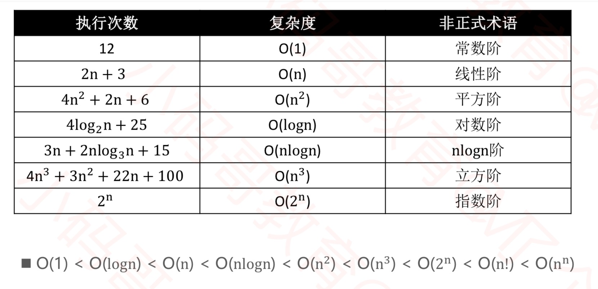
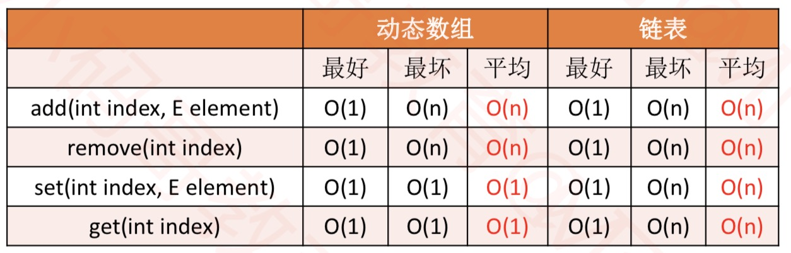

# 数据结构和算法

## 复杂度

如何评判一个算法的好坏，一般从以下维度来评估

* 正确性、可读性、健壮性（对不合理输入的反应能力和处理能力）
* 时间复杂度：估算程序指令的执行次数（执行时间）
* 空间复杂度：估算所需占用的存储空间

### 大O表示法

* 一般用大O来表示法来描述算法复杂度，它表示的是数据规模 n 对应的复杂度
* 忽略常数、系数、低阶
* 注意：大O表示法仅仅是一种粗略的分析模型，是一种估算，能帮助我们短时间内了解一个算法的执行效率

## 动态数组

OC中的可变数据就可以理解为动态数组，它继承自NSArray。

1. 初始化的时候会初始化一个不可变数组，设置一个固定的长度
2. 当内存空间不够用的时候，重新初始化一个内存空间，将之前的数据拷贝进新的存储空间，每种语言都会有一个固定的增长倍数常数
3. 通过遍历去完成元素的移动

## 单向链表

    public class ListNode {
        int val;
        ListNode next;
        ListNode(int x) { 
            val = x; 
        }
    }

size  数组规模n

## 双向链表

## 单向循环链表

## 双端队列

双端队列是能在头尾两端添加、删除的队列
英文deque是double ended queue的简称

## 循环队列
