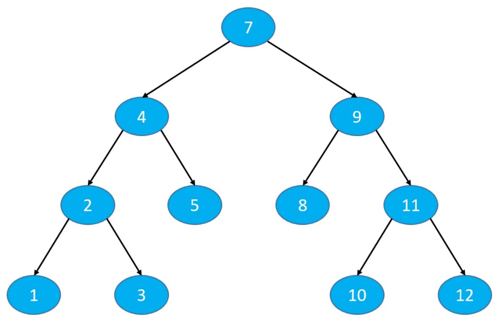
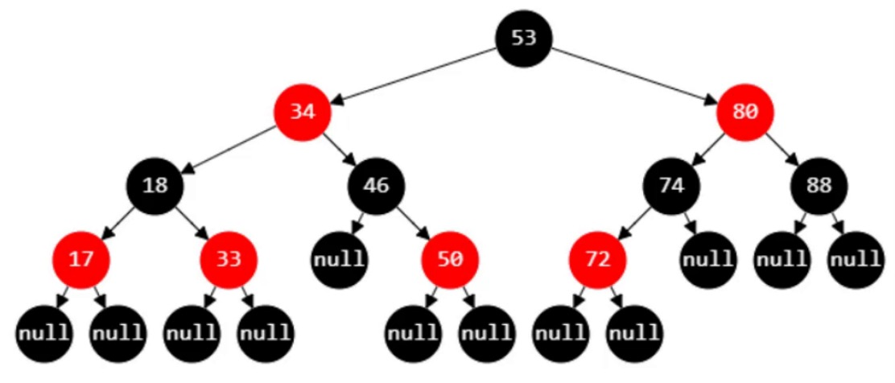

# 树

## 树的基本概念

* 节点、根节点、子节点、兄弟节点
* 一棵树可以没有任何节点，称为`空树`
* 一棵树可以只有1个节点，也就是只有根节点
* 子树、左子树、右子树
* 节点的`度`（degree）：子树的个数
* 树的`度`：所有节点度中的最大值
* `叶子`节点（leaf）：度为0的节点
* `非叶子`节点：度不为0的节点
* `层数`：根节点在第一层，根节点的子节点在第2层，以此类推
* 节点的`深度`：从根节点到当前节点的唯一途径上的节点总数
* 节点的`高度`：从当前节点到最远叶子节点的路径上的节点总数
* 树的`深度`：所有节点深度中的最大值
* 树的`高度`：所有节点高度中的最大值
* 树的`深度`等于树的`高度` 

## 有序树、无序树

* 有序树
  * 树中任意节点的子节点之间有顺序关系
* 无序树
  * 树中任意节点的子节点之间没有顺序关系
  * 也称为“自由树”

## 二叉树（Binary Tree）

二叉树特点：

* 每个节点的`度`最大为2（最多拥有2棵子树）
* 左子树和右子树是有顺序的，二叉树属于有序树
* 即使某节点只有一棵子树，也要区分左右子树

### 真二叉树（Proper Binary Tree）

所有节点的`度`要么为0，要么为2

### 满二叉树

所有节点的`度`要么为0，要么为2。且所有的`叶子`节点都在最后一层。

* 在同样高度的二叉树中，满二叉树的叶子节点数量最多，总节点数量最多多
* 满二叉树一定是真二叉树，真二叉树不一定是满二叉树

### 完全二叉树

叶子节点只会出现最后2层，且最后一层的`叶子`节点都`靠左`对齐

* 度为1的节点只有左子树
* 度为1的节点要么是1个，要么是0个
* 同样节点数量的二叉树，完全二叉树的高度最小

### 二叉搜索树（Binary Search Tree）

在n个动态的整数中搜索某个整数，查看其是否存在

* 假设使用动态数组存放元素，从第0个位置开始遍历搜索，平均时间复杂度：O(n)
* 如果维护一个有序的动态数组，使用二分搜索，最坏时间复杂度：O(logn)
  * 但是添加、删除的平均时间复杂度是O(n)
* 使用二叉搜索树，添加、删除、搜索的最坏时间复杂度均可以优化至：O(logn)

#### 特点

二叉搜索树是二叉树的一种，是应用非常广泛的一种二叉树，英文简称BST

* 又被称为：二叉查找树、二叉排序树
* 任意一个节点的值都`大于`其`左`子树所有节点的值
* 任意一个节点的值都`小于`其`右`子树所有节点的值
* 它的左右子树也是一颗二叉搜索树

二叉搜索树存储的元素必须具备可比较性

* 比如int、double 等
* 如果是自定义类型，需要指定比较方式
* 不允许为null

二叉搜索树可以大大提高搜索数据的效率

### 二叉树的遍历

根据节点访问顺序的不同，二叉树的常见遍历方式有4种

* 前序遍历
* 中序遍历
* 后序遍历
* 层序遍历

#### 前序遍历

访问顺序

* 根节点、前序遍历`左`子树，前序遍历`右`子树
* 7、4、2、1、3、5、9、8、11、10、12

遍历思路：递归

#### 中序遍历

访问顺序

* 中序遍历`左`子树、`根节点`、中序遍历`右`子树
* 1、2、3、4、5、7、8、9、10、11、12

遍历思路：递归

二叉搜索树的中序遍历结果是升序或者降序的

#### 后序遍历

访问顺序

* 后序遍历`左`子树、后序遍历`右`子树、`根节点`
* 1、3、2、5、4、8、10、12、11、9、7

遍历思路：递归

#### 层序遍历

访问顺序

* 从上到下、从左到右依次访问每一个节点
* 7、4、9、2、5、8、11、1、3、10、12

遍历思路：使用队列

1. 将根节点入队
2. 循环执行以下操作，直到队列为空
   1. 将队头节点A出队，进行`访问`
   2. 将A的左子节点入队
   3. 将A的右子节点入队

### 平衡二叉搜索树（Balanced Binary Search Tree）

平衡：当节点数量固定时，左右子树的高度越接近，这棵二叉树越平衡（高度越低）

经典常见的平衡二叉搜索树有

* AVL树
* 红黑树

#### AVL树

AVL树是最早发明的自平衡二叉搜索树之一

平衡因子：某节点的左右子树的高度差

AVL树的特点

* 每个节点的平衡因子只可能是1、0、-1（绝对值<=1，如果超过1，称之为“失衡”）
* 每个节点的左右子树高度差不超过1
* 搜索、添加、删除的时间复杂度是 O(logn)

#### 红黑树（Red Black Tree）

红黑树也是一种自平衡的二叉搜索树

红黑树必须满足以下5条性质

1. 节点是RED或者BLACK
2. 根节点是BLACK
3. 叶子节点（外部节点，空节点）都是BLACK
4. RED节点的子节点都是BLACK
   * RED节点的parent都是BLACK
   * 从根节点到叶子节点的所有路径上不能有2个连续的RED节点
5. 从任一节点到叶子节点的所有路径都包含相同数目的BLACK节点

### B树

B树是一种平衡的`多路`搜索树，多用于文件系统、数据库的实现
